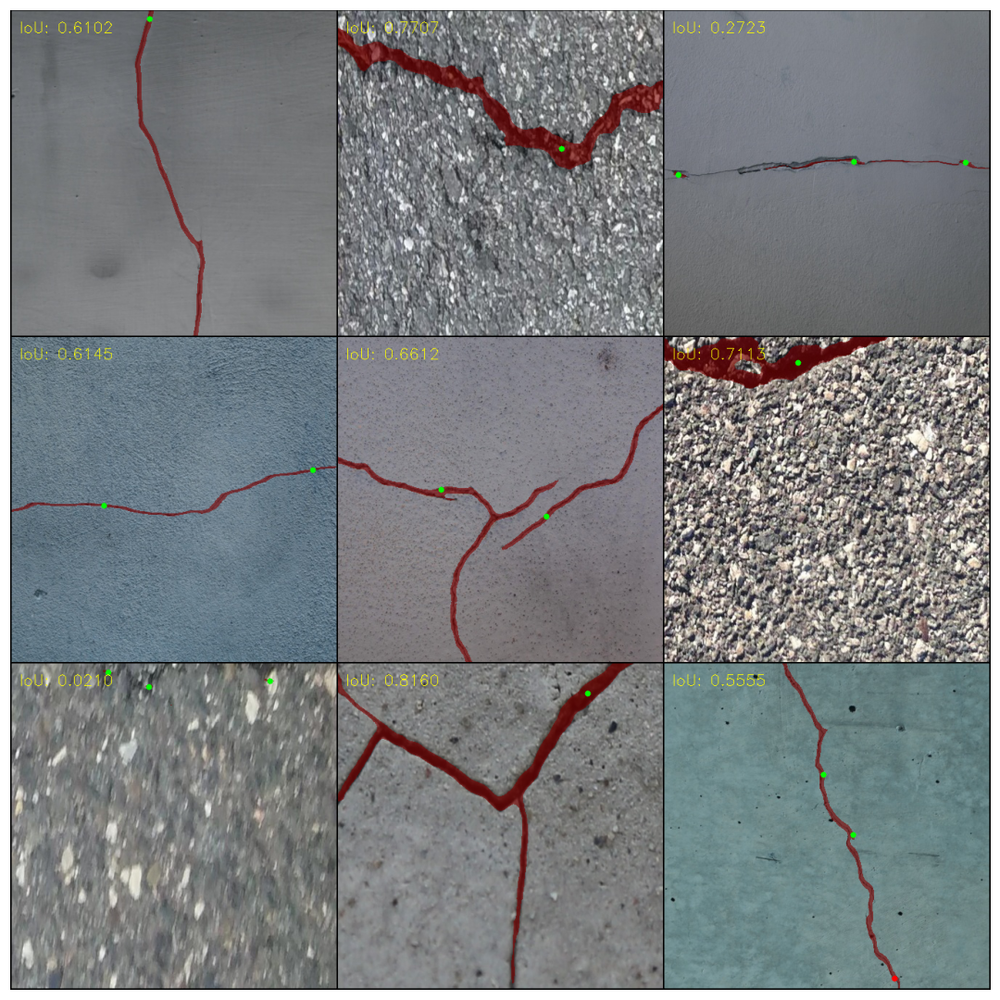

# supervisely-test

## 1. ClickSEG on Cracks

Для этой задачи я сделал отдельный репозиторий, т.к. было много изменений в коде ClickSEG. Все подбробности обучения там: https://github.com/max-unfinity/ClickSEG-cracks
Датасет трещин на kaggle: https://www.kaggle.com/datasets/lakshaymiddha/crack-segmentation-dataset
Обычно, модели нужно 1-3 клика для хороших результатов. Многие трещины хорошо предсказываются и в один клик.




## 2. Split and Merge

dependencies: numpy, opencv-python

Особенности:
**border mode.**
Метод split реализован 3-мя вариантами, разница в том как будут обрабатываться границы изображения:
- обрезка на границе (padding=False)
- padding
- padding_all_sides (картинка будет в центре, а паддинг по краям).

**smart merge.**
2 варианта merge: naive и "smart" (default)
- naive: все нарезанные картинки загружаются одна за одной, восстановивая изображение небольшими кусочкам.
- smart: выбирается минимально возможное число изображений. Каждое восстанавливает значительную часть исходной картинки. Это хорошо ускоряет обработку, когда картинка была нарезана с маленьким шагом (strides << window_size)

**multithreding.**
В split и в merge добавлена поддержка multithreding на загрузку и сохранение нарезанных изображений (параметр n_threads > 0). Это значительно ускоряет выполнение функций.

В test.py split и merge тестируются на случайном шуме со случайными входными параметрами.


## 3. Segmentation Visualizer

За основу взят метод instances2rgb из [imgviz](https://github.com/wkentaro/imgviz)

В visualize.py реализована основная функция - visualize(...), которая принимает на вход всё что нужно: img, bboxes, masks, labels, probs, colors. Остальные функции - вспомогательные, они нужны для предобработки данных.

Код instances.py из imgviz был изменен в некоторых местах. Были добавлены:
- адаптивный размер текста, который зависит от площади ббокса в log шкале
- сортировка масок по размеру. Так, на заднем плане окажутся большие объекты, а на переднем - маленькие. Это можно показать на первом примере - без этой сортировки большая маска стола заслоняла собой всё остальное:


## 4. Making Video Grid

Здесь нужен только ffmpeg с его -filter_complex и overlay. Скрипт работает на любом наборе видео клипов. То есть они могут быть разных разрешений, ориентаций и длительности. Каждому будет сделан паддинг, а длительность выбирается по самому короткому клипу. Вся мощь ffmpeg внутри))

`python make_grid.py sample_data2 --width 1920 --height 1080 --output result.mp4`


## 5. SegNeXt on 6 Lemons

Всего 6 сэмплов для обучения. mmsegmentation очень удобен и запускается на раз-два. Нужно всего лишь сделать правильный конфиг. Я взял tiny модель, обученную на ADE датасете, добавил сильные аугментации (RandomMosaic, RandomRotate, RandomFlip, RandomCrop). Модель показывает неплохие результаты на тесте (визуально). Можно сравнить модели со слабыми и сильными аугментациями (обе модели учились до схождения):

### Light augmentations (450 iters):


### Hard augmentations (700 iters):


**Download checkpoints:**

https://drive.google.com/drive/folders/1rmccjEZ_ckx0wNQe7viflY8FNvnr1o-8?usp=share_link


## 6. YOLOv7 YouTube Detector

### Как работает:
1. Получаем ссылку на видео с помощью [pytube](https://pytube.io/en/latest/index.html)
2. Скачиваем только нужные нам кадры с помощью ffmpeg
3. Детектим с YOLOv7

### Как запустить:
- install ffmpeg
- install requirements.txt and yolov7/requirements.txt
- download [yolov7 weights](https://github.com/WongKinYiu/yolov7/releases/download/v0.1/yolov7.pt)
- run main.py

```cd 6_yolov7_youtube_detector

python main.py https://www.youtube.com/watch?v=b41k2_MQNBk --n_frames 50 --fps 1.0 --device cpu --weights yolov7.pt```

### Results:


